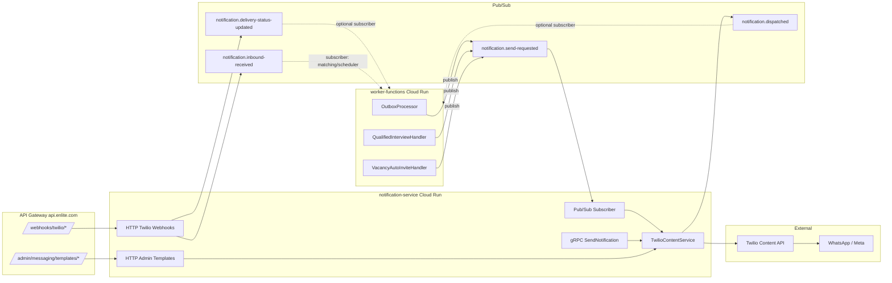

# SPRINT — Extração do módulo `notification/` para microserviço standalone

> Doc de planejamento. Implementação no branch `sprint/notification-extraction`.
> Sigla curta neste doc: **MS** = `notification-service` (Cloud Run, NestJS, stateless).
> Caller atual: `worker-functions/` (monolito modularizado em Cloud Run).

---

## 0. Sumário executivo

- **Objetivo:** extrair o módulo `worker-functions/src/modules/notification/` para um microserviço `notification-service` stateless, com Twilio Content API como source-of-truth de templates; eliminar `message_templates` (Postgres) do worker no fim do sprint; mover webhooks Twilio para o API Gateway central.
- **Duração:** **2 semanas** + **3-5 dias úteis de pré-trabalho** (infra GCP, Twilio Console, secrets).
- **Resultado esperado em D14 EOD:**
  - MS em produção respondendo `/health`, recebendo Pub/Sub `notification.send-requested` e gRPC `SendNotification`, expondo `/webhooks/twilio/{status,inbound}` atrás do Gateway.
  - `worker-functions` reconfigurado: `OutboxProcessor` publica Pub/Sub (não chama Twilio); handlers em `shared/events/handlers/` empacotam payload completo; `MessagingController` legado marcado deprecated.
  - Feature flag `NOTIFICATION_USE_REMOTE_SERVICE` em 100% e cutover validado por 48h.
  - Dívida residual mapeada como TD-022..TD-028 em `docs/FOLLOWUPS.md`.

### Não-objetivos (NÃO faremos nessa sprint)

- Mover `BookSlotFromWhatsAppUseCase` / `HandleReminderResponseUseCase` / `ReminderScheduler` para um `scheduler-service` (ficam no worker — TD-022).
- Mover `BulkDispatchIncompleteWorkersUseCase` / `BulkDispatchTalentumIncompleteUseCase` (orquestração + JOINs com `workers`/`encuadres` — ficam no worker — TD-023).
- Migrar `whatsapp_bulk_dispatch_logs` para `audit-service` (TD-024).
- Construir `shortlink-service`. Tokens PII em mensagens passam de `messaging_variable_tokens` para JWT assinado durante a sprint; a tabela `messaging_variable_tokens` continua existindo no Postgres do worker até o `shortlink-service` futuro (TD-025).
- Dropar `message_templates` no Postgres do worker (acontece em **sprint+1** após confirmar zero reads — TD-027).
- Implementar tracing distribuído além de `trace_id` propagado em metadata; OpenTelemetry/Tempo é cross-cutting fora deste sprint.
- Migrar para GKE/Istio. Cloud Run é o destino final do MS (ver §2).

---

## 1. Contexto

### Por que extrair agora

| Sintoma atual | Causa de fundo | Custo de adiar |
|---|---|---|
| `OutboxProcessor` faz IO Twilio síncrono no mesmo processo do worker | Acoplamento monolito | Picos de latência Twilio afetam request HTTP do admin |
| Templates duplicados (Postgres + Twilio Content Builder) | Decisão de arquitetura antiga | Drift constante entre `message_templates.content_sid` e Twilio (TD-018, TD-020 já abertos) |
| `TwilioWebhookController` recebe webhook diretamente em endpoint sem rate limit | Sem Gateway central | Atacante consegue floodar o Cloud Run direto |
| `worker-functions` precisa de credenciais Twilio | Não há boundary clara | Blast radius alto se um SA do worker vazar |

### Lugar do MS na arquitetura-alvo

`notification-service` corresponde ao MS #10 no inventário do **Bloco 6 §6.1** (linhas 100-115). Classificação: **Operacional** (sem PHI, sem PII persistido). Network policy em **Bloco 6 §6.x linhas 920-955**: ingress apenas do mesh, egress para Twilio + Pub/Sub + DNS. **mTLS STRICT** (Bloco 6 §6.5 linhas 1011-1023) quando rodar em GKE; em Cloud Run o equivalente é OIDC token + ingress=internal+gateway.

Decisão divergente: o **Bloco 6 §6.1** marca `notification-service` consumindo Redis para fila. Na arquitetura-alvo da Enlite a fila é **Pub/Sub gerenciado** (Cloud Run-friendly, sem necessidade de operar Redis). Esta divergência está justificada em §2 e registrada na arquitetura via Changelog.

### Estado atual em números (lido do código em 2026-05-19)

| Item | Contagem | Observação |
|---|---|---|
| Arquivos `.ts` (sem testes) em `worker-functions/src/modules/notification/` | 27 | `find ... -not -path "*/__tests__/*"` |
| Arquivos de teste em `worker-functions/src/modules/notification/**/__tests__/` | 14 | jest unit |
| Migrations de schema notification (lista §15.2) | 26 | de `007_` a `175_` |
| Tabelas Postgres tocadas pelo módulo | 6 | `message_templates`, `messaging_outbox`, `messaging_variable_tokens`, `whatsapp_bulk_dispatch_logs`, `interview_slots`, parcial em `worker_job_applications` |
| Use cases | 4 | `BookSlotFromWhatsApp`, `HandleReminderResponse`, `BulkDispatchIncompleteWorkers`, `BulkDispatchTalentumIncomplete` |
| Controllers HTTP | 5 | `Messaging`, `Internal`, `TwilioWebhook`, `InboundWhatsApp`, `RecruitmentHealth` |
| Endpoints HTTP expostos pelo módulo | 7 (admin) + 2 (webhook) + N (internal) | ver `worker-functions/src/modules/notification/interfaces/routes/messagingRoutes.ts` |
| Templates ativos com `content_sid` populado | VERIFICAR: rodar `SELECT slug, content_sid FROM message_templates WHERE is_active = true` em prd no D-3 | Tabela §15.1 |

---

## 2. Arquitetura-alvo (`notification-service`)

### Diagrama de comunicação



### Stack

| Camada | Escolha | Razão |
|---|---|---|
| Linguagem | TypeScript strict | Paridade com worker, reuso de tipos do Twilio SDK |
| Framework | NestJS | Padrão da arquitetura-alvo (Bloco 6 §6.3, §7.2). Suporte first-class para gRPC + HTTP + Pub/Sub via `@nestjs/microservices` |
| Runtime | Cloud Run (gen2, container) | Sem cluster GKE pra MS único stateless; auto-scale → 0; menor overhead operacional |
| Persistência | **NENHUMA** | Stateless por definição. Templates ficam no Twilio Content API |
| Cache | Memória local (Map) com TTL | Templates aprovados mudam raramente; `ContentSid → actions[]` já cacheado hoje em `InboundWhatsAppController.contentActionsCache` (linha 39) |
| Mensageria | Pub/Sub (Google managed) | Sem operar Redis; retry+DLQ nativo cobre §1052-1063 do Bloco 7 |
| Lib Twilio | `twilio` npm | Mesma usada em `TwilioMessagingService.ts:1` |

### Por que Cloud Run e não GKE

| Critério | Cloud Run | GKE+Istio | Decisão |
|---|---|---|---|
| Operação | Zero infra | Cluster + Istio + Helm | **Cloud Run** |
| Auto-scale a 0 | Sim | Não (HPA mín=1 ideal) | Cloud Run vence |
| mTLS service-to-service | OIDC ID token (gerenciado) | Istio STRICT (manual) | Equivalente, Cloud Run mais simples |
| Cold-start no path do Pub/Sub | Mitigado com min-instances≥1 | Inexistente | Aceitável |
| Trajetória | Bloco 6 marca `notification-service` em GKE (linha 113), mas o restante da Enlite (worker-functions, frontend) está em Cloud Run | — | **Manter em Cloud Run** consistente com o resto até houver razão clara para mover |

### Deployment Cloud Run

| Campo | Valor inicial | Observação |
|---|---|---|
| Service name | `notification-service` | Idêntico em prd e stg |
| Região | `southamerica-east1` | Mesma do worker (`enlite-prd`) |
| CPU | 1 vCPU | DECISÃO PENDENTE: validar com load test pré-go-live |
| Memory | 512 MiB | DECISÃO PENDENTE: idem |
| Concurrency | 80 | Default Cloud Run; Twilio SDK não tem state local |
| Min instances | **1** | Evita cold-start no path do Pub/Sub; ack_deadline 60s não tolera 8s de boot |
| Max instances | **20** | DECISÃO PENDENTE: estimar com `notification_send_total` pico de prd × 1.5 |
| Ingress | `internal-and-cloud-load-balancing` | Acessível só via Gateway + VPC connector do worker |
| Service account | `notification-service-sa@enlite-prd.iam` | §5.2 |
| VPC connector | **Não necessário** | Twilio é IP público, Pub/Sub é Private Google Access default |
| Health check | `GET /health` (NestJS Terminus) | Liveness + readiness separados |
| Image registry | `southamerica-east1-docker.pkg.dev/enlite-prd/services/notification-service:<sha>` | Artifact Registry, naming idêntico em stg |

### Por que NÃO Redis

Bloco 6 cita Redis como fila para `notification-service`. Análise:

- Pub/Sub cobre retry + DLQ + ordering key.
- Cache de `ContentSid → actions[]` cabe em memória local (poucos KB por SID, TTL implícito = vida do container).
- Idempotência (de-dupe de mensagens repetidas) é tratada pelo caller via `messaging_outbox.unique(worker_id, job_posting_id, template_slug)` já existente; MS não precisa estado.
- Operar Redis (Memorystore ou self-hosted) tem custo fixo. Não vale a pena para um único MS stateless.

Conclusão: **sem Redis nesta sprint**. Se métricas mostrarem necessidade de cache compartilhado entre instâncias (ex: throttling cross-instance), reabrir como TD pós-go-live.

---

## 3. Decisões arquiteturais cravadas

| # | Decisão | Rationale | Trade-off aceito |
|---|---|---|---|
| D1 | MS stateless puro, payload-driven, big-bang em 2 semanas | Evita estados híbridos; reduz superfície de bug; permite rollback simples via flag | Caller carrega responsabilidade de empacotar tudo (resolve `worker.phone`, `case_number` etc.) antes de publicar |
| D2 | Twilio Content API = única fonte de templates | Elimina drift `message_templates.content_sid` vs Twilio; aproveita sistema de approval nativo | Cache local sem invalidação push (TTL); admin que aprovar template pelo Console precisa esperar TTL ou hit forçado |
| D3 | Outbox caller-side: `messaging_outbox` permanece no worker; `OutboxProcessor` publica Pub/Sub em vez de chamar Twilio | Garante "at-least-once" + auditoria local + reaproveita índice/sweep existente | MS deixa de ver a tabela `messaging_outbox`; status de entrega volta via evento `notification.delivery-status-updated` que o worker subscreve |
| D4 | Short links via JWT assinado com TTL (sem storage) | `messaging_variable_tokens` no Postgres do worker some quando `shortlink-service` existir; JWT não exige storage; tokens viajam por WhatsApp em URL pública, JWT é stateless e revogável por chave-rotation | Não há revogação granular por token; mitigação: TTL curto + chave em Secret Manager com rotação programada |
| D5 | Webhooks Twilio atrás do API Gateway central, sem JWT | Twilio assina o request com `X-Twilio-Signature`; JWT é incompatível com sender externo | Defesas: (a) IP allowlist Twilio no Gateway, (b) rate limit, (c) WAF, (d) validação HMAC no MS |
| D6 | gRPC `NotificationService.SendNotification` implementado já no sprint, além do Pub/Sub subscriber | Path síncrono para chamadas user-facing (admin "enviar agora" do backoffice); Pub/Sub não dá resposta imediata | Duplicação parcial de surface; mitigada usando o mesmo `SendCommandHandler` interno |
| D7 | Payload canônico `notification.send-requested` com `metadata` opaco | MS não precisa entender domínio do caller; encaminha em eventos de saída | Caller perde o uso de operações DB no MS (ex: `UPDATE worker_job_applications.messaged_at`). É tarefa do caller subscrever `notification.dispatched` para reagir |

---

## 4. Contratos

### 4.1 Pub/Sub

#### 4.1.1 Topics consumidos pelo MS

##### `notification.send-requested`

| Campo | Valor |
|---|---|
| GCP topic name | `notification-send-requested` |
| Subscription do MS | `notification-send-requested-sub` |
| Message retention | `604800s` (7 dias) |
| Ack deadline | `60s` |
| Retry backoff | min `10s`, max `600s` (paridade Bloco 7 §7.4 linha 1017) |
| Max delivery attempts | `5` (paridade Bloco 7 §7.4 linha 1011) |
| Dead letter topic | `notification-send-requested-dlq` |
| Ordering key | **Não usar** — mensagens são independentes; bloqueio de ordering reduz throughput sem ganho |
| CMEK | Sim, mesma key do projeto (`google_kms_crypto_key.pubsub_key`) — paridade Bloco 7 §7.4 linha 910 |
| Publishers (SAs) | `worker-functions-sa@enlite-prd.iam`, `notification-service-sa@enlite-prd.iam` (re-publish em failure path) |
| Subscribers (SAs) | `notification-service-sa@enlite-prd.iam` |

Schema (canônico, JSON):

```json
{
  "to": "+5511999999999",
  "template_slug": "vacancy-invited-auto",
  "variables": {
    "worker_name": "Maria",
    "vacancy_case_number": "766",
    "distance_km": "5",
    "patient_zone": "Palermo"
  },
  "metadata": {
    "source": "worker-functions",
    "worker_id": "uuid",
    "application_id": "uuid",
    "job_posting_id": "uuid",
    "outbox_id": "uuid",
    "trace_id": "...",
    "idempotency_key": "outbox:<uuid>"
  }
}
```

Regras:

- `to` deve estar em E.164 — MS **rejeita** sem normalizar (caller faz; normalização atual em `TwilioMessagingService.normalizeNumber()` linha 159 migra para o caller).
- `template_slug` deve existir como Content Template aprovado no Twilio. MS rejeita se não encontrar (publica `notification.delivery-status-updated` com status `template_not_found`).
- `variables` valores **NUNCA** podem ser PHI/PII em plaintext; usar JWT short-link claim (`tk_*` legado migra na sprint). MS não inspeciona, apenas repassa.
- `metadata.idempotency_key` opcional; quando presente, MS deduplica em janela de 24h (cache em memória — DECISÃO PENDENTE: se cross-instance ficar relevante, abrir TD para Redis).

##### Mensagens DLQ

`notification-send-requested-dlq`:
- retention `2592000s` (30 dias — paridade Bloco 7 linha 993)
- subscription `notification-send-requested-dlq-monitoring` consumida por alert que dispara para Slack #ops-alerts (alert §10).

#### 4.1.2 Topics publicados pelo MS

##### `notification.dispatched`

Publicado após Twilio aceitar a mensagem (status inicial `queued` ou `sent`).

| Campo | Valor |
|---|---|
| GCP topic name | `notification-dispatched` |
| Retention | `604800s` |
| Subscribers | `worker-functions-notification-dispatched-sub` (no worker, para atualizar `messaging_outbox.twilio_sid`, `status='sent'`, `messaged_at`) |
| Retry | min `10s`, max `600s`, max-attempts `5` |
| DLQ | `notification-dispatched-dlq` |

Schema:

```json
{
  "external_id": "SM123abc...",
  "to": "+5511999999999",
  "template_slug": "vacancy-invited-auto",
  "status": "queued",
  "metadata": {
    "source": "worker-functions",
    "worker_id": "uuid",
    "outbox_id": "uuid",
    "trace_id": "..."
  },
  "dispatched_at": "2026-05-19T14:32:11.123Z"
}
```

##### `notification.delivery-status-updated`

Publicado quando o webhook Twilio `/webhooks/twilio/status` recebe atualização (`delivered`, `failed`, `read` etc.).

| Campo | Valor |
|---|---|
| GCP topic name | `notification-delivery-status-updated` |
| Retention | `604800s` |
| Subscribers | `worker-functions-delivery-status-sub` (atualiza `messaging_outbox.delivery_status` e `whatsapp_bulk_dispatch_logs.delivery_status` — paridade com SQL atual em `TwilioWebhookController.ts:60-79`) |
| Retry | min `10s`, max `600s`, max-attempts `5` |
| DLQ | `notification-delivery-status-updated-dlq` |

Schema:

```json
{
  "external_id": "SM123abc...",
  "status": "delivered",
  "error_code": null,
  "error_message": null,
  "raw_twilio_payload": { "...": "..." },
  "received_at": "2026-05-19T14:35:00.000Z"
}
```

##### `notification.inbound-received`

Publicado quando o webhook Twilio `/webhooks/twilio/inbound` recebe quick-reply ou texto livre do worker.

| Campo | Valor |
|---|---|
| GCP topic name | `notification-inbound-received` |
| Retention | `604800s` |
| Subscribers | `worker-functions-inbound-sub` consome para rotear para `BookSlotFromWhatsAppUseCase` / `HandleReminderResponseUseCase` (que **continuam no worker** — TD-022) |
| Retry | min `10s`, max `300s`, max-attempts `5` |
| DLQ | `notification-inbound-received-dlq` |

Schema:

```json
{
  "from": "+5511999999999",
  "body_text": "Sí",
  "button_payload": "confirm_yes",
  "original_replied_message_sid": "SM123...",
  "account_sid": "ACxxx",
  "received_at": "2026-05-19T14:40:00.000Z"
}
```

Notas:

- MS **não consulta** `messaging_outbox` para inferir `template_slug` — repassa cru. O subscriber no worker faz o lookup (lógica atual em `InboundWhatsAppController.ts:86-92`).
- O fallback de "inferir button payload via Content API" (linhas 183-224 do controller atual) **fica no MS** — é responsabilidade da camada Twilio. O MS já preenche `button_payload` no evento.

### 4.2 gRPC

#### 4.2.1 Proto

Arquivo: `proto/notification.proto` no MS. Baseado em **Bloco 7 §7.2.1 linhas 619-638**, expandido:

```proto
syntax = "proto3";
package enlite.notification.v1;

import "google/protobuf/timestamp.proto";

message NotificationMetadata {
  string source = 1;             // "worker-functions" | "backoffice-bff" | etc.
  string worker_id = 2;          // opaco para o MS
  string application_id = 3;
  string job_posting_id = 4;
  string outbox_id = 5;
  string trace_id = 6;
  string idempotency_key = 7;
}

message SendNotificationRequest {
  string to = 1;                 // E.164 obrigatório
  string template_slug = 2;
  map<string, string> variables = 3;
  NotificationMetadata metadata = 4;
}

message SendNotificationResponse {
  string external_id = 1;        // Twilio MessageSid
  string status = 2;             // "queued" | "sent" | "failed"
  string error_message = 3;      // populado quando status="failed"
}

message TemplateApprovalStatus {
  string sid = 1;
  string slug = 2;               // friendly_name no Twilio
  string approval_status = 3;    // "received" | "pending" | "approved" | "rejected" | "paused"
  string rejection_reason = 4;
  google.protobuf.Timestamp updated_at = 5;
}

message GetTemplateApprovalRequest {
  string sid = 1;
}

service NotificationService {
  rpc SendNotification(SendNotificationRequest) returns (SendNotificationResponse);
  rpc GetTemplateApproval(GetTemplateApprovalRequest) returns (TemplateApprovalStatus);
}
```

#### 4.2.2 Auth service-to-service (Cloud Run)

Em Cloud Run, o caller obtém **OIDC ID token** assinado pelo Google (audience = URL do MS) usando seu service account; MS valida via biblioteca `google-auth-library`. Não há JWT custom para este path.

Fluxo:

1. `worker-functions` (SA `worker-functions-sa`) chama metadata server:
   `GET http://metadata.google.internal/computeMetadata/v1/instance/service-accounts/default/identity?audience=https://notification-service-xxx.run.app`
2. Recebe ID token JWT assinado pelo Google.
3. Coloca em `Authorization: Bearer <id_token>`.
4. MS valida assinatura (Google JWKS), `aud`, `email` ∈ allowlist.

#### 4.2.3 Allowlist de callers

Callers permitidos para invocar `notification-service`:

| SA caller | Pode chamar | Razão |
|---|---|---|
| `worker-functions-sa@enlite-prd.iam` | `SendNotification`, `GetTemplateApproval` | Outbox processor, handlers, MessagingController legado durante cutover |
| `api-gateway-sa@enlite-prd.iam` | rota HTTP `/admin/messaging/templates/*` | Encaminhamento de admin HTTP (gateway → MS) |
| `backoffice-bff-sa@enlite-prd.iam` (futuro) | `SendNotification` | Quando BFF for criado |

IAM via `roles/run.invoker` no service Cloud Run + check de `email` claim no interceptor NestJS.

### 4.3 HTTP — Webhooks Twilio

#### 4.3.1 `POST /webhooks/twilio/status`

| Campo | Valor |
|---|---|
| Content-Type | `application/x-www-form-urlencoded` (Twilio default) |
| Auth | **X-Twilio-Signature** (HMAC) validado no MS via `twilio.validateRequest()` |
| Rota no Gateway | `POST https://api.enlite.com/webhooks/twilio/status` → backend MS |
| Resposta | 200 OK sempre (mesmo em erro DB, para evitar retry Twilio — paridade `TwilioWebhookController.ts:54,82`) |
| Evento publicado | `notification.delivery-status-updated` |

Campos recebidos (do Twilio, subset relevante):

- `MessageSid` (obrigatório)
- `MessageStatus` (`queued|sent|delivered|read|failed|undelivered`)
- `ErrorCode` (opcional, presente em failure)
- `ErrorMessage` (opcional)

Comportamento:

1. Valida `X-Twilio-Signature` contra URL canônica `https://api.enlite.com/webhooks/twilio/status` (config no MS via env `TWILIO_STATUS_CALLBACK_URL`).
2. Se inválido → 403.
3. Se válido → publica `notification.delivery-status-updated` com payload completo.
4. Responde 200.

#### 4.3.2 `POST /webhooks/twilio/inbound`

| Campo | Valor |
|---|---|
| Content-Type | `application/x-www-form-urlencoded` |
| Auth | X-Twilio-Signature + fallback `AccountSid` match (paridade `InboundWhatsAppController.ts:267-298`) |
| Rota no Gateway | `POST https://api.enlite.com/webhooks/twilio/inbound` |
| Resposta | 200 OK |
| Evento publicado | `notification.inbound-received` |

Campos:

- `From`, `Body`, `ButtonPayload`, `OriginalRepliedMessageSid`, `AccountSid`

Comportamento:

1. Valida assinatura (mesma estratégia atual).
2. Se `ButtonPayload` ausente, tenta inferir via Twilio Content API (lógica atual em `InboundWhatsAppController.ts:183-224` migra para o MS).
3. Publica `notification.inbound-received`.
4. Responde 200.

#### 4.3.3 Configuração no Twilio Console

| Item | Valor |
|---|---|
| WhatsApp Sender → "When a message comes in" | `https://api.enlite.com/webhooks/twilio/inbound` (POST) |
| WhatsApp Sender → "Status callback URL" | `https://api.enlite.com/webhooks/twilio/status` (POST) |
| Quando alterar | D9 (cutover §6.3) |

#### 4.3.4 Configuração no API Gateway

| Item | Valor |
|---|---|
| Rotas | `/webhooks/twilio/*` → backend Cloud Run `notification-service` |
| Auth | **Nenhum JWT** (Twilio é cliente externo) |
| Rate limit | DECISÃO PENDENTE: sugestão `1000 req/min por IP`; volume real em prd é VERIFICAR: contar webhooks últimos 7 dias em `whatsapp_bulk_dispatch_logs.delivery_status` updates |
| IP allowlist | IPs públicos Twilio — referência oficial https://www.twilio.com/docs/sip-trunking/ip-addresses (lista de "Egress IP Addresses Twilio Cloud") + WhatsApp-specific IPs. Carregar como list no Gateway config; revisar trimestralmente |
| WAF | DECISÃO PENDENTE: Cloud Armor com regra OWASP Top 10 default. Confirmar custo |
| Log | Cloud Logging com request body redacted exceto `MessageSid`, `MessageStatus`, `From` |

### 4.4 HTTP — Admin Templates

Endpoints expostos pelo MS, atrás do Gateway com JWT validation.

| Método | Path | Auth/Role | Descrição | Mapeia para Twilio |
|---|---|---|---|---|
| GET | `/admin/templates` | JWT `admin` ou `messaging:write` | Lista templates do account Twilio | `GET https://content.twilio.com/v1/Content` |
| GET | `/admin/templates/:sid` | idem | Detalhe de um Content Template | `GET https://content.twilio.com/v1/Content/{sid}` |
| POST | `/admin/templates` | idem | Cria Content Template | `POST https://content.twilio.com/v1/Content` |
| POST | `/admin/templates/:sid/approval-requests/whatsapp` | idem | Submete para aprovação WhatsApp/Meta | `POST https://content.twilio.com/v1/Content/{sid}/ApprovalRequests/whatsapp` |
| GET | `/admin/templates/:sid/approval-requests` | idem | Lê status atual da aprovação | `GET https://content.twilio.com/v1/Content/{sid}/ApprovalRequests` |
| DELETE | `/admin/templates/:sid` | idem | Deleta Content Template | `DELETE https://content.twilio.com/v1/Content/{sid}` |

Filtros suportados em `GET /admin/templates`:

- `approval_status=approved|pending|rejected|received|paused` (query param)
- `language=pt_BR|es|en|...`
- `page_size` (default 100, max 1000)
- `page_token` (cursor)

Auth: JWT validado pelo Gateway (identity-platform tokens, conforme **Bloco 8 §8.1**). Custom claim necessária: `role in ['admin', 'compliance_officer']` OU `permissions[].includes('messaging:write')`.

### 4.5 JWT Short Links

#### 4.5.1 Algoritmo

**Escolha: ES256 (ECDSA com P-256 + SHA-256).**

Justificativa:

| Critério | HS256 (HMAC) | ES256 (ECDSA) | Decisão |
|---|---|---|---|
| Tamanho da assinatura | 32 bytes | 64 bytes | HS256 menor, mas tokens em URL — ambos curtos o bastante |
| Compartilhamento de chave | Quem assina = quem verifica (chave simétrica) | Privada assina, pública verifica | **ES256 vence** — se `shortlink-service` futuro for criado, ele pode validar tokens sem ter a chave de assinatura |
| Rotation | Difícil (todos os verifiers precisam da nova chave ao mesmo tempo) | Simples (rotaciona privada; pública via JWKS endpoint) | **ES256** |
| Performance | Mais rápido | Mais lento (~10x), mas insignificante (μs) | Empate |
| Risk de leak | Vaza chave = atacante assina | Vaza pública = atacante só verifica (ok) | **ES256** |

#### 4.5.2 Claims

```json
{
  "iss": "enlite-worker-functions",
  "sub": "<worker_id_uuid>",
  "action": "book_slot" | "confirm_reminder" | "decline_reminder" | "reschedule",
  "application_id": "<uuid>",
  "job_posting_id": "<uuid>",
  "iat": 1716120000,
  "exp": 1716206400,
  "jti": "<uuid-v4>"
}
```

**Proibido nos claims:** `worker_name`, `phone`, `email`, `case_number`, qualquer PHI ou PII identificável. Token viaja em URL pública via WhatsApp.

#### 4.5.3 TTL por action

| Action | TTL recomendado | Razão |
|---|---|---|
| `book_slot` | 7 dias | WhatsApp re-engage window padrão |
| `confirm_reminder` | 48h | Reminder é T-24h, dá margem |
| `decline_reminder` | 48h | idem |
| `reschedule` | 7 dias | Worker pode demorar |

#### 4.5.4 Chave de assinatura

- **Local:** Secret Manager — `notification-jwt-signing-key-private` (PEM PKCS#8 ECDSA P-256) + `notification-jwt-signing-key-public` (PEM SPKI).
- **Quem acessa privada:** `worker-functions-sa@enlite-prd.iam` apenas (caller é quem emite).
- **Quem acessa pública:** todos os SAs que validam (futuro `shortlink-service-sa`).
- **Rotação:** semestral. Manter `kid` no header JWT + endpoint JWKS expondo histórico (futuro).
- **Format:** JWS compacto, header `{"alg":"ES256","kid":"<key-id>"}`.

#### 4.5.5 Emissão e validação

- **Emissão (worker-functions):** novo `JwtShortLinkService` em `worker-functions/src/modules/notification/infrastructure/JwtShortLinkService.ts` (substitui `TokenService.generate()` para tokens de short-link; tokenização de PII em `variables` JSON migra para JWT também).
- **Validação:** durante esta sprint, o **próprio worker-functions** valida (consome a chave pública no boot). Quando `shortlink-service` existir, validação migra.
- **Variáveis em template Twilio:** se a variável for `worker_name` ou similar que hoje vai como `tk_*`, passa a ir como **URL do short-link** (ex: `https://app.enlite.com/r/<jwt>`) ou como **plaintext mascarado** dependendo do template — DECISÃO PENDENTE por template (alguns templates não usam short-link, só nome; nome pode ir plaintext via JWT-claim do caller — mas isso reintroduz PII em payload Pub/Sub. **Recomendação:** review template-a-template; default conservador = não enviar nome do worker no template, usar genérico).

---

## 5. Infraestrutura GCP

### 5.1 Cloud Run service

| Campo | Valor (paridade `enlite-prd` e `enlite-stg`) |
|---|---|
| Service | `notification-service` |
| Região | `southamerica-east1` |
| Image | `southamerica-east1-docker.pkg.dev/{project}/services/notification-service:<sha>` |
| Min instances | 1 (prd) / 0 (stg) |
| Max instances | 20 (prd) / 5 (stg) |
| Memory | 512 MiB |
| CPU | 1 vCPU |
| Concurrency | 80 |
| Timeout | 60s (suficiente para Twilio Content API roundtrip + Pub/Sub publish) |
| Ingress | `internal-and-cloud-load-balancing` |
| SA | `notification-service-sa@enlite-prd.iam.gserviceaccount.com` (idem para stg) |
| VPC connector | não |
| Container port | 8080 |
| Health checks | startup `/health`, liveness `/health/live`, readiness `/health/ready` |

### 5.2 Service accounts e IAM

| SA | Roles | Usado por | Justificativa |
|---|---|---|---|
| `notification-service-sa` | `roles/pubsub.subscriber` (em `notification-send-requested`), `roles/pubsub.publisher` (em `notification-dispatched`, `notification-delivery-status-updated`, `notification-inbound-received`), `roles/secretmanager.secretAccessor` (em secrets §5.4), `roles/logging.logWriter`, `roles/monitoring.metricWriter`, `roles/cloudtrace.agent` | MS | Princípio do menor privilégio — sem SQL, sem Healthcare, sem GCS (Bloco 6 §6.2 padrão) |
| `worker-functions-sa` (existente, **adicionar**) | `roles/pubsub.publisher` (em `notification-send-requested`), `roles/run.invoker` (em service `notification-service`), `roles/secretmanager.secretAccessor` (em `notification-jwt-signing-key-private`) | Worker | Publicar `send-requested`, invocar gRPC, assinar JWT |
| `api-gateway-sa` (existente, **adicionar**) | `roles/run.invoker` (em service `notification-service`) | Gateway | Encaminhar `/admin/messaging/templates/*` e `/webhooks/twilio/*` |
| `worker-functions-sa` (existente, **adicionar**) | `roles/pubsub.subscriber` (em `notification-dispatched`, `notification-delivery-status-updated`, `notification-inbound-received`) | Worker | Reagir a eventos de saída do MS |

Naming idêntico prd↔stg (memory: `feedback_naming_prd_stg`).

### 5.3 Pub/Sub

| Topic | Subscriptions | Publishers (SAs) | Subscribers (SAs) | DLQ | Retry |
|---|---|---|---|---|---|
| `notification-send-requested` | `notification-send-requested-sub` | worker-functions-sa, notification-service-sa | notification-service-sa | `notification-send-requested-dlq` (max-attempts 5) | min 10s, max 600s |
| `notification-send-requested-dlq` | `notification-send-requested-dlq-monitoring` | (sistema) | alert-router-sa (futuro; hoje cloud monitoring direct) | — | — |
| `notification-dispatched` | `worker-functions-notification-dispatched-sub` | notification-service-sa | worker-functions-sa | `notification-dispatched-dlq` (5) | min 10s, max 600s |
| `notification-dispatched-dlq` | monitoring | — | — | — | — |
| `notification-delivery-status-updated` | `worker-functions-delivery-status-sub` | notification-service-sa | worker-functions-sa | `notification-delivery-status-updated-dlq` (5) | min 10s, max 600s |
| `notification-delivery-status-updated-dlq` | monitoring | — | — | — | — |
| `notification-inbound-received` | `worker-functions-inbound-sub` | notification-service-sa | worker-functions-sa | `notification-inbound-received-dlq` (5) | min 10s, max 300s |
| `notification-inbound-received-dlq` | monitoring | — | — | — | — |

Todos os topics com CMEK (paridade Bloco 7 §7.4 linha 910), `message_retention_duration = 604800s`. Naming idêntico stg.

### 5.4 Secret Manager

| Secret | Conteúdo | Quem acessa | Rotação |
|---|---|---|---|
| `notification-twilio-account-sid` | Twilio Account SID | notification-service-sa | Manual quando Twilio rotacionar |
| `notification-twilio-api-key-sid` | API Key SID (não Auth Token; mover para API Keys é melhor prática) | notification-service-sa | Trimestral |
| `notification-twilio-api-key-secret` | API Key Secret | notification-service-sa | Trimestral |
| `notification-twilio-webhook-token` | Auth Token usado para validar `X-Twilio-Signature` (continua sendo o Auth Token Twilio; signature usa esse) | notification-service-sa | Manual |
| `notification-jwt-signing-key-private` | PEM PKCS#8 ECDSA P-256 chave privada | worker-functions-sa | Semestral |
| `notification-jwt-signing-key-public` | PEM SPKI chave pública | notification-service-sa (futuro), worker-functions-sa | idem |

Naming idêntico prd↔stg.

### 5.5 API Gateway

Rotas a adicionar:

| Rota | Backend | Auth | Rate limit | IP allowlist |
|---|---|---|---|---|
| `/webhooks/twilio/status` (POST) | notification-service | Nenhum JWT; X-Twilio-Signature validado no MS | DECISÃO PENDENTE: `1000 req/min` por IP | Twilio Egress IPs |
| `/webhooks/twilio/inbound` (POST) | notification-service | idem | idem | idem |
| `/admin/messaging/templates` (GET, POST) | notification-service | JWT admin/messaging:write | `60 req/min` por user | — |
| `/admin/messaging/templates/:sid` (GET, DELETE) | notification-service | idem | idem | — |
| `/admin/messaging/templates/:sid/approval-requests` (GET) | notification-service | idem | idem | — |
| `/admin/messaging/templates/:sid/approval-requests/whatsapp` (POST) | notification-service | idem | `10 req/min` por user (criação custosa) | — |
| `/api/admin/messaging/whatsapp` (POST) — **deprecated** | worker-functions | idem | mantido por 1 sprint pra rollback | — |
| `/api/admin/messaging/whatsapp/direct` (POST) — **deprecated** | worker-functions | idem | idem | — |

WAF (Cloud Armor): aplicar OWASP Top 10 rule preset em `/admin/*`. Webhooks Twilio escapam do WAF body-inspection (body é form-urlencoded com `Body` contendo texto livre do worker — risco de false positive); aplicar só header rules.

---

## 6. Plano de execução

### 6.1 Pré-trabalho (3-5 dias úteis, antes de D1)

Checklist obrigatório:

- [ ] Twilio Console: API Key + Secret criados (admin permissions). Secrets `notification-twilio-api-key-sid` e `notification-twilio-api-key-secret` populados em prd+stg.
- [ ] Secret `notification-twilio-webhook-token` populado com Twilio Auth Token (signature validation).
- [ ] Chave ECDSA P-256 gerada local: `openssl ecparam -genkey -name prime256v1 -noout -out priv.pem && openssl ec -in priv.pem -pubout -out pub.pem`. Secrets `notification-jwt-signing-key-private` e `notification-jwt-signing-key-public` populados.
- [ ] Service accounts criados: `notification-service-sa` em prd+stg.
- [ ] IAM bindings aplicados (todos os roles da §5.2).
- [ ] Pub/Sub topics + subscriptions + DLQs criados via Terraform (§5.3). Verificar que CMEK funciona.
- [ ] Artifact Registry repo `services/notification-service` criado em `southamerica-east1` (prd+stg).
- [ ] DNS `api.enlite.com` registrado (se ainda não) + cert SSL. **VERIFICAR: hoje existe?** Se não, é dependência crítica do cutover. DECISÃO PENDENTE.
- [ ] API Gateway config (rotas + WAF + rate limits) escrito em Terraform mas **não ativado** até D9.
- [ ] Twilio Egress IP list importada (snapshot da doc oficial). DP: ver lista atual no D-1.
- [ ] Repo `notification-service` criado, CI pipeline (build → push image → deploy stg) testado com hello-world.
- [ ] Tabela §15.1 (mapa template_slug → content_sid) consolidada com Ops. Templates faltando approval (TD-018, TD-020) submetidos.

### 6.2 Semana 1 — Construir notification-service

| Dia | Entrega | Critério de feito | Risco |
|---|---|---|---|
| D1 | Repo bootstrapped (NestJS + Dockerfile padrão Bloco 6 §6.3 + CI/CD) | `GET /health` responde 200 em stg | baixo |
| D1 | `proto/notification.proto` versionado | Build gera código TS sem erro | baixo |
| D2 | `TwilioContentService` (envia via Content API) implementado + unit tests | Send mock retorna `external_id` | médio — depende de credenciais |
| D2 | `SendCommandHandler` (lógica core: dedup idempotency_key + chamada Twilio + publish `notification.dispatched`) | Unit tests cobrem happy + Twilio failure + template_not_found | médio |
| D3 | gRPC `SendNotification` integrado ao `SendCommandHandler` | E2E: caller stg consegue invocar | médio — OIDC token chato |
| D3 | Pub/Sub subscriber `notification.send-requested` integrado | E2E: publish em stg → MS chama Twilio sandbox → `notification.dispatched` aparece | médio |
| D4 | Webhook `POST /webhooks/twilio/status` + X-Twilio-Signature validator + publica `notification.delivery-status-updated` | E2E: curl simulando Twilio com signature válida → evento aparece | alto — signature é chato de validar |
| D4 | Webhook `POST /webhooks/twilio/inbound` + button payload inference via Content API + publica `notification.inbound-received` | idem | alto |
| D5 | Admin Templates HTTP (CRUD + Approval): `GET /admin/templates`, `POST`, `DELETE`, `POST /:sid/approval-requests/whatsapp`, `GET /:sid/approval-requests` | E2E: criar template + submit approval em sandbox Twilio | médio |
| D5 | Auth interceptor: OIDC ID token + JWT admin para HTTP | Unit + E2E | médio |
| D6 | Métricas Prometheus exportadas (counters, histograms §10) + structured logs (pino) com `trace_id` propagado de metadata | Dashboards (§10) renderizam dados de stg | baixo |
| D6 | Tests E2E cross-service em docker-compose (worker-stg + notification-service-stg + Pub/Sub emulator) | suite verde local | médio |
| D7 | Deploy MS em prd (sem cutover ainda) | Service rodando, health verde, recebendo 0 tráfego real (apenas synthetic) | médio |
| D7 | Buffer / catch-up | — | — |

### 6.3 Semana 2 — Refactor worker-functions + cutover

| Dia | Entrega | Critério de feito | Risco |
|---|---|---|---|
| D8 | Worker: `JwtShortLinkService` implementado; `TokenService.generate()` deprecated para tokens de short-link (mantido para PII variables enquanto não há decisão template-a-template) | Unit tests verdes; existing E2E mantém-se | médio |
| D8 | Worker: novo cliente Pub/Sub publisher `NotificationPublisher` que publica `notification-send-requested` | Unit | baixo |
| D8 | Worker: novo cliente gRPC para chamadas síncronas (substitui call direta a Twilio em `MessagingController` quando flag = true) | Unit | médio |
| D9 | Worker: `OutboxProcessor.processOne()` refatorado — em vez de `this.messaging.sendWhatsApp(...)` chama `notificationPublisher.publish(...)`. Estado da row: status='dispatched_to_ms' (novo) até receber `notification.dispatched` via subscriber, então vira 'sent' | Unit + integration tests | **alto** — coração do fluxo |
| D9 | Worker: subscriber para `notification-dispatched` que atualiza `messaging_outbox.twilio_sid` + `status='sent'` | E2E end-to-end com sandbox Twilio | alto |
| D9 | Worker: subscriber para `notification-delivery-status-updated` que atualiza `messaging_outbox.delivery_status` + `whatsapp_bulk_dispatch_logs.delivery_status` | E2E | médio |
| D9 | Worker: subscriber para `notification-inbound-received` que invoca `BookSlotFromWhatsAppUseCase`/`HandleReminderResponseUseCase` (lógica de roteamento atual em `InboundWhatsAppController.handleInbound` migra pra cá; o controller HTTP é apagado) | E2E | **alto** — fluxo de booking |
| D10 | **Twilio Console reconfigurado**: status callback e inbound webhook apontam para `https://api.enlite.com/webhooks/twilio/*`. Webhooks antigos no worker desativados via flag | Smoke test: enviar template em prd, ver status chegar via MS, atualizar outbox | **crítico** |
| D10 | API Gateway ativado (rotas §5.5) | Curl externo bate, allowlist Twilio respeitada | médio |
| D10 | Trigger SQL `fn_queue_talent_search_welcome` (migration 060) **substituído** por handler de domain event — handler `WorkerCreatedHandler` que insere em `messaging_outbox` quando `data_sources @> ['talent_search']` na primeira vez | Migration drop trigger + nova migration aditiva sem perda | médio |
| D10 | Arquivo `worker-functions/src/interfaces/routes/twilioWebhookRoutes.ts` deletado (órfão) + grep confirma zero refs | grep limpo | trivial |
| D11 | **Cutover 10%** — feature flag `NOTIFICATION_USE_REMOTE_SERVICE` habilitada para 10% dos sends (hash de worker_id) | Métrica `notification_send_total{source=worker-functions, path=remote}` aumenta; `path=local` cai 10%; taxa de erro estável | alto |
| D11 | Monitorar 2-4 horas. Critério avanço: erro rate remote ≤ erro rate local; latência p95 ≤ baseline + 500ms; zero mensagens em DLQ | métrica + log | — |
| D12 | **Cutover 50%** | Métrica idem | alto |
| D12 | Monitorar 2-4 horas | idem | — |
| D13 | **Cutover 100%** | Worker chama Twilio direto = 0 | alto |
| D13 | `MessagingController.sendToWorker/sendDirect` marcado `@deprecated`, mantido funcional para rollback (chama o MS via gRPC quando flag=true; via Twilio direto quando flag=false) | Endpoint responde mas registra deprecation log | médio |
| D13 | Migration: tornar `messaging_outbox.twilio_sid` nullable (passa a ser preenchido async) — VERIFICAR: já é nullable? Sim (migration 065). Sem mudança. | — | trivial |
| D14 | 48h após D12 sem rollback → declarar sprint concluído. Atualizar `docs/FOLLOWUPS.md` com TD-022..TD-028 (§13) | doc commitado | baixo |
| D14 | Runbook operacional escrito | doc em `docs/runbooks/notification-service.md` | baixo |

---

## 7. Refactor checklist no worker-functions

Lista exaustiva. Cada item com arquivo:linha quando aplicável.

1. **`OutboxProcessor` deixa de chamar Twilio**
   `worker-functions/src/modules/notification/infrastructure/OutboxProcessor.ts:113` → substituir `this.messaging.sendWhatsApp(...)` por `this.notificationPublisher.publish({to, templateSlug, variables, metadata})`. Remove dependência de `IMessagingService` no construtor. Status da row passa de `pending` para `dispatched_to_ms`; transição `→ sent` vira responsabilidade do subscriber de `notification.dispatched`. Mantém `attempts`, `error`, `processed_at` para audit.

2. **Handler `VacancyAutoInviteHandler` empacota payload completo**
   `worker-functions/src/shared/events/handlers/VacancyAutoInviteHandler.ts:114-129` → continua inserindo em `messaging_outbox` (idempotency 7 dias é local). O insert no outbox e o publish em `outbox-enqueued` ficam idênticos; o que muda é o consumer downstream (OutboxProcessor publica para o MS em vez de chamar Twilio). Nenhuma mudança requerida neste arquivo.

3. **Handler `QualifiedInterviewHandler` idem**
   `worker-functions/src/shared/events/handlers/QualifiedInterviewHandler.ts:83-100` → idem. Insert em `messaging_outbox` permanece; OutboxProcessor toma conta.

4. **Substituir `TokenService` por `JwtShortLinkService`** (somente para short-links)
   Novo arquivo: `worker-functions/src/modules/notification/infrastructure/JwtShortLinkService.ts`. Métodos: `sign({sub, action, application_id, job_posting_id, ttl}): string` e `verify(jwt): claims`. Assina com chave privada de Secret Manager. `TokenService` mantido para variáveis PII em templates legacy (tk_*) — apaga quando `messaging_variable_tokens` for migrada (TD-025). DECISÃO PENDENTE: para cada template legacy, decidir se a variável PII vira JWT, vira plaintext via Twilio (caller side) ou some.

5. **Trigger SQL `fn_queue_talent_search_welcome` em `workers`** (migration 060)
   Drop trigger + função. Substituir por handler de domain event no worker (camada de aplicação publica `worker.data-sources-updated` quando `data_sources` muda; handler subscreve e insere em `messaging_outbox`). Razão: trigger acopla schema do worker à existência de `messaging_outbox` — pior quando `messaging_outbox` migrar para o MS (TD futuro). Por ora a tabela continua no worker, mas o cleanup do trigger é parte deste sprint para reduzir dependências SQL implícitas.
   Migration nova (sequência ~176, conforme padrão): `DROP TRIGGER trg_talent_search_welcome ON workers; DROP FUNCTION fn_queue_talent_search_welcome();`. Código aplicacional substitui.

6. **`MessagingController` deprecated**
   `worker-functions/src/modules/notification/interfaces/controllers/MessagingController.ts:1` → adicionar JSDoc `@deprecated`. Endpoints continuam respondendo. Em `sendToWorker` (linha 34) e `sendDirect` (linha 114): quando feature flag `NOTIFICATION_USE_REMOTE_SERVICE=true`, em vez de chamar `this.messaging.sendWhatsApp`, fazer gRPC call para MS. Quando flag=false, mantém comportamento atual (rollback). Em sprint+1: deletar arquivo + remover rota.

7. **Arquivo órfão `src/interfaces/routes/twilioWebhookRoutes.ts`** (não conectado ao `index.ts`)
   `worker-functions/src/interfaces/routes/twilioWebhookRoutes.ts` → DELETAR. Confirmado via grep que não é importado no `index.ts` nem em `bootstrap/startServer.ts` (referência única é dentro do próprio arquivo). Já existia como código morto.

8. **Webhook routes ativos**
   `worker-functions/src/modules/integration/interfaces/webhooks/routes/webhookRoutes.ts:6-7,22,32-43` → quando Twilio Console apontar pra Gateway (D10), as rotas `/api/webhooks/twilio/*` no worker viram defesa em profundidade durante cutover; manter por 1 sprint. Em sprint+1: remover as rotas `/twilio/status` e `/twilio/inbound` + remover imports do `TwilioWebhookController` e `InboundWhatsAppController` no worker. Os controllers viajam para o MS (não são re-criados, são migrados com o conteúdo).

9. **Imports cross-module que ficam (aceitar como dívida)**
   - `worker-functions/src/modules/notification/application/BookSlotFromWhatsAppUseCase.ts:6` — `GoogleCalendarService` de `@modules/matching`. NÃO MUDA — use case fica no worker (TD-022 futuro mover para scheduler-service).
   - `worker-functions/src/modules/notification/application/HandleReminderResponseUseCase.ts:5` — idem.
   - `worker-functions/src/modules/notification/interfaces/controllers/MessagingController.ts:8` — `AuthMiddleware` de `@modules/identity`. NÃO MUDA — controller será removido em sprint+1.

10. **Apagar `TwilioMessagingService` do worker no fim**
    `worker-functions/src/modules/notification/infrastructure/TwilioMessagingService.ts` → após cutover 100% + 7 dias sem rollback (sprint+1), DELETAR + remover do `index.ts:31`. Configuração `TWILIO_ACCOUNT_SID`/`TWILIO_AUTH_TOKEN`/`TWILIO_WHATSAPP_NUMBER` removida do `.env` do worker; mantida só no MS.

11. **`InboundWhatsAppController` e `TwilioWebhookController`**
    `worker-functions/src/modules/notification/interfaces/controllers/InboundWhatsAppController.ts` e `.../TwilioWebhookController.ts` → migrados (copiados + adaptados) para o MS na semana 1. No worker, ficam vivos durante cutover; em sprint+1, removidos. A lógica de inferir button payload via Content API (linhas 183-224) vai inteira para o MS — usa Twilio API key que só o MS tem.

12. **`RecruitmentHealthController`**
    `worker-functions/src/modules/notification/interfaces/controllers/RecruitmentHealthController.ts` → leitura de saúde do pipeline (queries em `interview_slots`, `messaging_outbox`). **Fica no worker** — depende de tabelas locais. Sem mudança neste sprint.

13. **`InternalController`**
    `worker-functions/src/modules/notification/interfaces/controllers/InternalController.ts` → VERIFICAR: rotas internas (Cloud Scheduler invocando bulk-dispatch). Mantido no worker.

14. **Index barrel**
    `worker-functions/src/modules/notification/index.ts` → no fim do sprint+1, remover exports de `TwilioMessagingService`, `MessagingController`, `TwilioWebhookController`, `InboundWhatsAppController`, `TokenService` (quando aplicável). Manter `OutboxProcessor`, `MessageTemplateRepository` (até DROP de `message_templates`), `BulkDispatch*`, `BookSlot*`, `HandleReminder*`, `ReminderScheduler`, `InterviewSlot*`.

---

## 8. Feature flag e cutover

### 8.1 Flag

- Nome: `NOTIFICATION_USE_REMOTE_SERVICE`
- Tipo: env var booleana percentual: aceita `false`, `true`, ou `pct:<N>` onde N=0..100.
- Default: `false` em D1; vai progredindo.

### 8.2 Implementação no worker

```typescript
// Esboço em pseudocódigo (não código pra implementar agora)
function shouldUseRemote(workerId: string): boolean {
  const flag = process.env.NOTIFICATION_USE_REMOTE_SERVICE ?? 'false';
  if (flag === 'true') return true;
  if (flag === 'false') return false;
  const m = flag.match(/^pct:(\d+)$/);
  if (!m) return false;
  const pct = parseInt(m[1], 10);
  // bucket determinístico por worker_id (hash → 0..99)
  const bucket = hashStringToBucket(workerId, 100);
  return bucket < pct;
}
```

Hash determinístico por `workerId` garante que o mesmo worker fica sempre no mesmo bucket — evita um worker receber metade das mensagens via worker e metade via MS (estado inconsistente).

### 8.3 Etapas de cutover e critérios

| Etapa | Flag | Critério para avançar | Tempo mínimo |
|---|---|---|---|
| 0 → 10 | `pct:10` | `error_rate(remote) ≤ error_rate(local) + 0.5%`; `latency_p95(remote) ≤ latency_p95(local) + 500ms`; DLQ `notification.send-requested` = 0 | 2h |
| 10 → 50 | `pct:50` | idem | 2h |
| 50 → 100 | `pct:100` ou `true` | idem | 4h |
| 100 → stable | `true` | sem rollback nas últimas **48h** | 48h |

### 8.4 Rollback

- Setar `NOTIFICATION_USE_REMOTE_SERVICE=false` no Cloud Run env do worker.
- Aplicar via `gcloud run services update worker-functions --update-env-vars NOTIFICATION_USE_REMOTE_SERVICE=false`.
- Cloud Run faz redeploy em ~30s, próximas requests vão pelo path local (Twilio direto).
- Mensagens já publicadas em `notification.send-requested` continuam sendo processadas pelo MS (não há como "desfazer" o publish). Isso é OK porque o efeito é o mesmo (Twilio envia). Risco: dupla entrega se a mesma row for re-processada local. Mitigação: `OutboxProcessor` checa status antes de processar; ao detectar `dispatched_to_ms`, pula.

---

## 9. Testes

### 9.1 No notification-service (novo)

**Unit:**

- `TwilioContentService.sendWithContentSid` — mocka Twilio client, valida formato `whatsapp:<E164>`, contentVariables JSON.
- `SendCommandHandler` — happy path, Twilio failure, template_not_found, idempotency_key dedup.
- `WebhookSignatureValidator` — assinatura válida, inválida, sem header, fallback `AccountSid` match.
- `JwtValidator` (no path admin gRPC) — OIDC token válido/expirado/audience errado.
- `PubSubSubscriber` — ack, nack, DLQ, mensagem malformada.
- `TemplateApprovalClient` — list, get, submit, error handling.
- `ButtonPayloadInferrer` — match por título case-insensitive, sem match, Content API 404.

**E2E (suite dedicada com Pub/Sub emulator + Twilio mock via nock):**

- POST publish em `notification.send-requested` → MS chama Twilio mock → assert `notification.dispatched` publicado.
- POST `/webhooks/twilio/status` com signature válida → assert `notification.delivery-status-updated` publicado.
- POST `/webhooks/twilio/status` com signature inválida → 403.
- POST `/webhooks/twilio/inbound` com `ButtonPayload` → assert `notification.inbound-received` publicado.
- POST `/webhooks/twilio/inbound` sem `ButtonPayload` mas com `Body` matchable → inferred payload publicado.
- gRPC `SendNotification` happy + failure.
- gRPC `GetTemplateApproval` retorna status do Twilio.
- HTTP `GET /admin/templates` filtrado por `approval_status=approved`.
- HTTP `POST /admin/templates/:sid/approval-requests/whatsapp` happy.

**Contract test (snapshot):**

- Para cada topic publicado (`notification.dispatched`, `notification.delivery-status-updated`, `notification.inbound-received`): snapshot do schema JSON; teste falha se schema mudar sem atualizar snapshot. Permite consumer no worker confiar.

### 9.2 No worker-functions (refactor)

**Atualizar / deletar testes existentes:**

| Arquivo | Ação |
|---|---|
| `worker-functions/src/modules/notification/infrastructure/__tests__/TwilioMessagingService.test.ts` (447 linhas) | DELETAR após cutover 100%; mantido durante sprint para validar path de rollback |
| `worker-functions/src/modules/notification/infrastructure/__tests__/OutboxProcessor.test.ts` (328 linhas) | REFATORAR — substituir mock de `IMessagingService` por mock de `NotificationPublisher`; assert que publica payload correto em vez de chamar Twilio |
| `worker-functions/src/modules/notification/interfaces/controllers/__tests__/MessagingController.test.ts` (205 linhas) | REFATORAR — adicionar testes com flag on/off; assert gRPC call quando on, Twilio direto quando off. Manter até sprint+1 |
| `worker-functions/src/modules/notification/interfaces/controllers/__tests__/InboundWhatsAppController.test.ts` (867 linhas) | DELETAR após cutover; lógica migra para MS. Substituir por teste do **subscriber** `notification.inbound-received` no worker que invoca `BookSlotFromWhatsAppUseCase` |
| `worker-functions/src/modules/notification/interfaces/controllers/__tests__/InternalController.test.ts` (325 linhas) | MANTER — endpoints internos não migram |
| `worker-functions/src/modules/notification/application/__tests__/BulkDispatchIncompleteWorkersUseCase.test.ts` | REFATORAR — agora orquestra publish em vez de send |
| `worker-functions/src/modules/notification/application/__tests__/BulkDispatchTalentumIncompleteUseCase.test.ts` | idem |
| `worker-functions/src/modules/notification/application/__tests__/BookSlotFromWhatsAppUseCase.test.ts` (354 linhas) | MANTER — use case continua no worker |
| `worker-functions/src/modules/notification/application/__tests__/HandleReminderResponseUseCase.test.ts` | MANTER |

**E2E backend (`tests/e2e/`):**

| Test | Ação |
|---|---|
| `tests/e2e/whatsapp-messaging.test.ts` | REPENSAR — split: parte vira teste do MS (Twilio call), parte fica no worker como teste do publisher |
| `tests/e2e/message-templates.test.ts` | MIGRAR para o MS (templates CRUD migra) |
| `tests/e2e/inbound-whatsapp.test.ts` | MIGRAR para o MS (webhook recebe inbound) + criar teste novo no worker que mocka publish `notification.inbound-received` e valida roteamento |
| `tests/e2e/bulk-dispatch.test.ts` / `bulk-dispatch-talentum.test.ts` | REFATORAR — assert publish em Pub/Sub em vez de Twilio call direto |

**Testes a CRIAR no worker:**

- `tests/e2e/notification-publisher.test.ts` — `OutboxProcessor` publica payload correto.
- `tests/e2e/notification-dispatched-subscriber.test.ts` — recebe `notification.dispatched`, atualiza `messaging_outbox.twilio_sid` + `status='sent'`.
- `tests/e2e/notification-delivery-status-subscriber.test.ts` — recebe `notification.delivery-status-updated`, atualiza `delivery_status`.
- `tests/e2e/notification-inbound-subscriber.test.ts` — recebe `notification.inbound-received`, roteia para use cases corretos.
- `tests/e2e/feature-flag-cutover.test.ts` — flag on/off muda path; bucket determinístico.

### 9.3 Integration E2E cross-service

Setup: `docker-compose.cross.yml` no monorepo (raiz):

- `worker-functions` (image build local)
- `notification-service` (image build local)
- `pubsub-emulator` (gcr.io/google.com/cloudsdktool/cloud-sdk:emulators)
- `twilio-mock` (nock server respondendo a `https://api.twilio.com/*` e `https://content.twilio.com/*`)
- `postgres` (já existe na config E2E)

Cenários:

1. **Send happy path:** API admin do worker → publish → MS → Twilio mock → publish dispatched → worker atualiza outbox. Assert: `messaging_outbox.status='sent'`, `twilio_sid` preenchido.
2. **Delivery status:** Twilio mock dispara webhook → Gateway mock → MS → publish → worker. Assert: `messaging_outbox.delivery_status='delivered'`.
3. **Inbound button:** Twilio mock dispara webhook inbound → MS → publish → worker → `BookSlotFromWhatsAppUseCase` invocado. Assert: `worker_job_applications.interview_response='confirmed'` + slot reservado.
4. **DLQ:** MS retorna erro permanente 5x → mensagem vai para DLQ. Assert: counter `notification_send_dlq_total` incrementa.
5. **Idempotency:** publish 2x mesma `metadata.idempotency_key` → Twilio chamado 1x. Assert: contador `notification_dedup_hits_total` incrementa.

---

## 10. Observability

### 10.1 Logs

- Lib: `pino` (paridade com `worker-functions/src/shared/logging/Logger.ts`).
- Campos obrigatórios em todo log: `trace_id` (de `metadata.trace_id` do payload), `template_slug`, `external_id` quando aplicável.
- Sem PII em log (validar via lint regra ou code review).
- Destino: stdout → Cloud Logging.

### 10.2 Métricas Cloud Monitoring

| Métrica | Tipo | Labels | Descrição |
|---|---|---|---|
| `notification_send_total` | counter | `template_slug`, `status` (sent/failed/template_not_found), `source` (metadata.source), `path` (grpc/pubsub) | Total de sends processados |
| `notification_send_duration_seconds` | histogram | `template_slug`, `path` | Latência total send (publish recebido → Twilio respondeu) |
| `notification_twilio_call_duration_seconds` | histogram | `endpoint` (content_send / approval_get / etc.) | Latência da chamada Twilio |
| `notification_webhook_processed_total` | counter | `webhook` (status/inbound), `result` (ok/signature_invalid/parse_error) | Webhooks processados |
| `notification_template_approval_lag_minutes` | gauge | `slug` | Tempo desde submit até approved/rejected (sampled) |
| `notification_dedup_hits_total` | counter | `template_slug` | Mensagens deduplicadas por `idempotency_key` |
| `notification_dlq_messages_total` | counter | `topic` | Mensagens em DLQ |
| `notification_inbound_button_inferred_total` | counter | `result` (matched/no_match) | Inferência via Content API |

### 10.3 Dashboards (Cloud Monitoring → Dashboards)

Dashboard `notification-service`:

- Painel 1: send rate (gráfico `rate(notification_send_total[5m])` agrupado por `path` + `status`).
- Painel 2: error rate `rate(notification_send_total{status='failed'}[5m]) / rate(notification_send_total[5m])`.
- Painel 3: latência p50/p95/p99 (`notification_send_duration_seconds`).
- Painel 4: webhook rate + signature failures (`notification_webhook_processed_total`).
- Painel 5: DLQ count (`notification_dlq_messages_total`).
- Painel 6: template approval lag (top 10 slugs by `notification_template_approval_lag_minutes`).

### 10.4 Alertas

| Alerta | Condição | Severity | Destino |
|---|---|---|---|
| Twilio error rate alto | `rate(notification_send_total{status='failed'}[5m]) / rate(notification_send_total[5m]) > 0.05` por 5min | high | Slack #ops-alerts + PagerDuty |
| DLQ não vazio | `notification_dlq_messages_total > 0` por 1min | high | idem |
| Latência p95 alta | `histogram_quantile(0.95, notification_send_duration_seconds) > 2s` por 10min | medium | Slack |
| Template aprovação rejected | webhook ou poll detecta `approval_status=rejected` | immediate | Slack #ops + email Ops |
| Signature invalid spike | `rate(notification_webhook_processed_total{result='signature_invalid'}[5m]) > 5` | high | Slack + investigar atacante |
| MS instance count = 0 | `cloud_run_instance_count{service='notification-service'} == 0` por 1min | critical | PagerDuty |

---

## 11. Rollback plan

| Nível | Sintoma | Ação | RTO |
|---|---|---|---|
| L1 | Bug funcional no MS (template_not_found falso positivo, parse erro, Twilio call mal formado) | `gcloud run services update worker-functions --update-env-vars NOTIFICATION_USE_REMOTE_SERVICE=false` | < 5 min |
| L1b | MS está fora do ar (cold start, deploy ruim) | idem (rollback flag) + investigar instance count | < 5 min |
| L2 | Bug no refactor do worker (OutboxProcessor publica payload errado, subscriber não atualiza outbox) | Reverter commit no worker (`git revert <sha>` + redeploy) | < 30 min |
| L2b | Twilio Console pointing pro Gateway mas Gateway com bug | Reapontar Twilio Console para webhook antigo no worker (`https://worker-functions-xxx.run.app/api/webhooks/twilio/status`); rotas no worker ainda vivas durante cutover | < 15 min (config Twilio é instantânea após save) |
| L3 | Mensagens duplicadas, perdidas, ou status corrompido | Procedimento de reconciliação manual: query `messaging_outbox` com `status='dispatched_to_ms'` + idade > 1h (não recebeu `notification.dispatched`); re-publicar via script `scripts/replay-outbox.ts` (criar como parte do sprint) | horas |
| L3b | DLQ acumulou mensagens | `scripts/drain-dlq.ts` reprocessa após fix do bug que levou pra DLQ | horas |

---

## 12. Critérios de aceite (mensuráveis)

Checklist do D14 EOD:

- [ ] `notification-service` em prd respondendo `GET /health` com 200.
- [ ] Min-instances=1 em prd; uptime últimas 48h ≥ 99.5%.
- [ ] `NOTIFICATION_USE_REMOTE_SERVICE=true` ou `pct:100` em prd.
- [ ] Métrica `notification_send_total{source='worker-functions', path='pubsub'}` ≥ baseline diário esperado (>0 todos os dias dos últimos 2).
- [ ] Métrica `notification_send_total{path='local'}` = 0 nas últimas 48h.
- [ ] Twilio Console: status callback e inbound apontam pra `api.enlite.com/webhooks/twilio/*`.
- [ ] Gateway: rotas `/webhooks/twilio/*` e `/admin/messaging/templates/*` ativas; smoke test passa.
- [ ] Templates: POST `/admin/templates` cria; POST `.../approval-requests/whatsapp` submete; GET `.../approval-requests` retorna `pending` ou `approved`.
- [ ] DLQ `notification.send-requested.dlq` = 0 nas últimas 48h (ou justificado em runbook).
- [ ] E2E worker passando: `notification-publisher`, `notification-dispatched-subscriber`, `notification-delivery-status-subscriber`, `notification-inbound-subscriber`, `feature-flag-cutover`.
- [ ] E2E MS passando: send via Pub/Sub, webhooks status+inbound, admin templates CRUD + approval.
- [ ] E2E cross-service (`docker-compose.cross.yml`) passando.
- [ ] Dashboards `notification-service` em Cloud Monitoring acessíveis.
- [ ] Alertas (§10.4) configurados e testados (dispara em ambiente stg simulando falha).
- [ ] Runbook em `docs/runbooks/notification-service.md` com seção "Rollback" + "DLQ replay" + "Twilio template approval" escrita.
- [ ] TDs registrados em `docs/FOLLOWUPS.md` (§13 abaixo).
- [ ] Arquivo `worker-functions/src/interfaces/routes/twilioWebhookRoutes.ts` deletado.
- [ ] Trigger SQL `trg_talent_search_welcome` dropado; nova migration aditiva commitada.
- [ ] Documentação interna: este doc atualizado com qualquer decisão alterada durante execução.

---

## 13. FOLLOWUPS (dívida residual)

Próximo número disponível em `docs/FOLLOWUPS.md`: **TD-022** (último: TD-021 da Sprint Recruitment Automation).

- **TD-022** — `BookSlotFromWhatsAppUseCase` + `HandleReminderResponseUseCase` + `ReminderScheduler` + `InterviewSlotRepository` permanecem no `worker-functions` após esta sprint. Migrar para `scheduler-service`/`matching-service` futuro. Bloqueador: tabelas `interview_slots`, `worker_job_applications` (FK), GoogleCalendarService.
- **TD-023** — `BulkDispatchIncompleteWorkersUseCase` + `BulkDispatchTalentumIncompleteUseCase` permanecem no worker. Orquestração que JOINs `workers`, `encuadres`, `worker_documents`. Migrar para `orchestrator-service` ou `matching-service` futuro (dependendo do MS que dono dessas tabelas).
- **TD-024** — `whatsapp_bulk_dispatch_logs` permanece no Postgres do worker. Migrar para `audit-service` (Bloco 6 §6.1 linha 110, BigQuery + Cloud Logging append-only).
- **TD-025** — `messaging_variable_tokens` permanece no Postgres do worker (até `shortlink-service` existir). Durante esta sprint a tabela continua usada para tokens PII legacy (`tk_*`), enquanto short-links de ação migram para JWT. Quando todas as PII variables migrarem para JWT-claim no caller ou plaintext direto via Twilio, a tabela some.
- **TD-026** — `MessagingController` no worker (`worker-functions/src/modules/notification/interfaces/controllers/MessagingController.ts`) marcado deprecated nesta sprint. Remover em sprint+1 (depois de confirmar zero tráfego — métrica em Cloud Monitoring).
- **TD-027** — Tabela `message_templates` no Postgres do worker continua viva durante esta sprint (legacy callers). Dropar em sprint+1 após confirmar: (a) zero leituras em `message_templates` (`pg_stat_user_tables.idx_scan` = 0 por 7 dias), (b) `MessageTemplateRepository` removido do barrel export, (c) `TwilioMessagingService` removido do worker.
- **TD-028** — Arquivo `worker-functions/src/interfaces/webhooks/controllers/TwilioWebhookController.ts` (legado, fora do módulo notification) — confirmar se também é morto e deletar no mesmo PR de cleanup. VERIFICAR no D-1.
- **TD-029** — Trigger SQL `fn_queue_talent_search_welcome` na migration 060 substituído por handler de aplicação. Garantir que dump anonimizado prd→stg (TD-012) não reintroduza o trigger.
- **TD-030** — `NOTIFICATION_USE_REMOTE_SERVICE` flag remover do código do worker em sprint+1 (quando rollback não for mais necessário). Hoje fica como contingência.
- **TD-031** — `RecruitmentHealthController` no worker depende de `interview_slots` e `messaging_outbox` locais. Vai sair em conjunto com TD-022 (mover para scheduler-service).

---

## 14. Decisões pendentes

Itens que o user precisa cravar antes do D1 (ou justificar adiamento):

- **DP-N1** — Algoritmo JWT short-link: **proposta = ES256**. Aprovar ou contrapropor HS256 + Cloud KMS HSM.
- **DP-N2** — Max-instances Cloud Run do MS em prd. Proposta = 20. Validar com volume real (VERIFICAR pico atual de send/min em prd).
- **DP-N3** — CPU/Memory Cloud Run do MS. Proposta = 1 vCPU / 512 MiB. Validar com load test em stg.
- **DP-N4** — Rate limit no Gateway para webhooks Twilio. Proposta = 1000 req/min por IP. Validar com volume real Twilio (VERIFICAR).
- **DP-N5** — WAF (Cloud Armor) no Gateway: ativar ou adiar? Custo + risco de false positive em `Body` de inbound WhatsApp.
- **DP-N6** — Cada template PII variable: vira JWT-URL no template, vira plaintext via caller-side, ou some? Review template-a-template (lista §15.1). Por default conservador, ficar sem PII em variables — usar genérico (paridade migration 060 que já usa `'Profissional'` como fallback).
- **DP-N7** — DNS `api.enlite.com`: existe? Cert SSL? Se não, é dependência crítica do cutover.
- **DP-N8** — Twilio Egress IP list: snapshot oficial em D-1 ou usar IP ranges + flag `*.twilio.com` DNS-based allowlist (Gateway suporta?).
- **DP-N9** — Subscriber de `notification.dispatched` no worker é necessário? Hoje o `OutboxProcessor` atualiza `twilio_sid` síncronamente após o send. Após refactor, MS publica `dispatched` e worker subscreve para atualizar. Alternativa: aceitar que `messaging_outbox.twilio_sid` fica NULL por alguns segundos (só vira preenchido quando vier `delivery-status-updated`). Trade-off de complexidade vs latência de update.
- **DP-N10** — Cloud Run service-to-service com gRPC: Cloud Run suporta gRPC nativamente desde 2021, mas o `worker-functions` está hoje em Cloud Run v1 (TD-010). Verificar compatibilidade. Plano B: usar HTTP/2 JSON REST em vez de gRPC.

---

## 15. Anexos

### 15.1 Mapa template_slug → Twilio Content SID

Reconstruído lendo todas as migrations citadas. Para templates sem `content_sid` populado, mensagens em prod retornam erro (TD-018, TD-020).

| Slug | Content SID | Body resumido | Variáveis (nomeadas) | Lang | Status estimado | Origem (migration) |
|---|---|---|---|---|---|---|
| `talent_search_welcome` | NULL (sandbox/free-form) | "Olá {{name}}! Encontramos o seu perfil..." | `name` | pt_BR | livre (sem HSM) | 059 (insert) |
| `vacancy_match` | NULL | "Olá {{name}}! Temos uma vaga de {{role}} em {{location}}..." | `name`, `role`, `location` | pt_BR | livre | 059 |
| `encuadre_scheduled` | NULL | "Olá {{name}}! Sua entrevista foi agendada para {{date}} às {{time}}..." | `name`, `date`, `time` | pt_BR | livre | 059 |
| `qualified_worker` | `HX1a4188493b5fdf099aab812c9c9cfa99` (legacy) | inválido (7 variáveis, deprecated) | — | es | DEPRECATED — renomeado em 122 | 108, 121 |
| `qualified_worker_request` | `HX13ee9b7c406830e7eda764a052700c42` | "Opções de entrevista — {{slot_1}}, {{slot_2}}, {{slot_3}}, caso {{case_number}}" | `slot_1`, `slot_2`, `slot_3`, `case_number` | es | APPROVED (HSM) | 122 |
| `qualified_worker_response` | `HXed69d4daca5e063902af3177c5ebca5d` | confirmação curta | — | es | APPROVED | 122 |
| `qualified_reminder_confirm` | `HXcfcca88f4fc5ec4e00663ed8dd303a8b` | "¡Hola {{name}}! Mañana {{date}} a las {{time}}... ¿Vas a participar?" | `name`, `date`, `time` | es | APPROVED | 124 |
| `qualified_reprogram_confirm` | `HXf07d6a0407ae68ccd1b402e82b32b1a8` | "¡Perfecto!... Tu solicitud de reagendamiento para el caso {{case_number}}..." | `case_number` | es | APPROVED | 125, 126 |
| `qualified_declined_thanks` | NULL (free-form) | "¡Muchas gracias por tu respuesta!..." | — | es | livre | 127 |
| `qualified_reminder_reschedule` | VERIFICAR — migration 123 inserts, content_sid? | (reschedule flow) | VERIFICAR | es | VERIFICAR | 123 |
| `qualified_reminder_reason` | VERIFICAR — migration 123 inserts | (capture reason free-text) | VERIFICAR | es | livre | 123 |
| `vacancy_invited_auto` | **NULL** (TD-018 — pré-go-live obrigatório) | "{{worker_name}}, hay una vaga en {{patient_zone}}... caso {{vacancy_case_number}} ({{distance_km}} km)" | `worker_name`, `vacancy_case_number`, `distance_km`, `patient_zone` | es | PENDING approval | 174 |
| `talentum_incomplete_reminder` | **NULL** (TD-020 — pré-go-live obrigatório) | "¡Hola {{worker_name}}! Notamos que tu proceso de selección en Enlite está pendiente..." | `worker_name` | es | PENDING approval | 175 |
| `complete_register_ofc` | VERIFICAR — referenciado em código (BulkDispatch) mas não achei na lista de migrations citadas | (lembrete cadastro incompleto) | VERIFICAR | es | VERIFICAR | VERIFICAR |

VERIFICAR antes do D1: rodar `SELECT slug, content_sid, is_active, body FROM message_templates ORDER BY slug` em prd e validar contra esta tabela. Templates que existem em prd mas não estão aqui = drift = TD novo.

### 15.2 Migrations do schema notification — status pós-sprint

| Migration | O que mudou | Status pós-sprint |
|---|---|---|
| 007 | Adiciona `whatsapp_phone`, `lgpd_consent_at` a `workers` | **FICA** — coluna de domínio worker |
| 059 | Cria `message_templates` (tabela) | **DEPRECATED** — drop em sprint+1 (TD-027) |
| 060 | Cria `messaging_outbox` + trigger `fn_queue_talent_search_welcome` | **PARCIAL** — tabela fica; trigger DROPADO nesta sprint (item §7.5); função recriada como handler aplicacional |
| 061 | Adiciona `messaged_at` a `worker_job_applications` | **FICA** — coluna usada por matching no worker |
| 062 | Cria `whatsapp_bulk_dispatch_logs` | **FICA** (TD-024 mover para audit-service) |
| 063 | Adiciona `content_sid` a `message_templates` | **DEPRECATED** com 059 |
| 065 | Adiciona `twilio_sid` + `delivery_status` a `messaging_outbox` + `delivery_status` a `whatsapp_bulk_dispatch_logs` | **FICA** — agora preenchido async via subscriber de `notification.delivery-status-updated` |
| 066 | `whatsapp_bulk_dispatch_logs.worker_id` nullable | **FICA** |
| 085 | Comments + ON DELETE SET NULL nas FKs de messaging | **FICA** |
| 086 | Cria `messaging_variable_tokens` | **FICA** durante sprint; cleanup com TD-025 |
| 087 | Índice em `processed_at` + função cleanup | **FICA** |
| 095 | Cria `interview_slots` + templates `qualified_reminder_*` | **FICA** (TD-022) |
| 099 | Cria `domain_events` + tracking entrevista QUALIFIED | **FICA** — `domain_events` é shared infra event-driven, não exclusivo do notification |
| 108 | Insere template `qualified_worker` com content_sid `HX1a418...` | **DEPRECATED** — substituído por 122 (rename) |
| 121 | Corrige variáveis `qualified_worker` para 4 | **DEPRECATED** com 108 |
| 122 | Renomeia `qualified_worker → qualified_worker_request`, `qualified_slot_confirmed → qualified_worker_response`. Novos content_sids `HX13ee...`, `HXed69...` | **PRESERVAR DADOS** — em sprint+1 quando dropar `message_templates`, os Content SIDs ainda valem (estão no Twilio); a tabela só registrava o mapping |
| 123 | Reminder reschedule/decline flow + templates `qualified_reminder_reschedule`, `qualified_reminder_reason` + states `REPROGRAM`, `RECHAZADO` em `application_funnel_stage` | **FICA** (states no enum funnel ficam; templates migram para Twilio Content API) |
| 124 | Set content_sid para `qualified_reminder_confirm` (`HXcfcc...`) | **DEPRECATED** com 059 (Twilio é source) |
| 125 | Insere template `qualified_reprogram_confirm` (`HXf07d...`) | idem |
| 126 | Fix body do `qualified_reprogram_confirm` | idem |
| 127 | Insere template `qualified_declined_thanks` (sem content_sid) | idem |
| 170 | Adiciona `batch_id` a `whatsapp_bulk_dispatch_logs` + `messaging_outbox` | **FICA** |
| 171 | Adiciona `trace_id` a `messaging_outbox` + `domain_events` | **FICA** — `trace_id` passa a vir do `metadata.trace_id` do payload Pub/Sub |
| 172 | Adiciona `source` a `whatsapp_bulk_dispatch_logs` (com CHECK constraint) | **FICA** |
| 173 | Adiciona `job_posting_id` a `messaging_outbox` + índice dedup | **FICA** — usado pela idempotency do `VacancyAutoInviteHandler` |
| 174 | Insere template `vacancy_invited_auto` (content_sid NULL, TD-018) | **DEPRECATED** com 059 |
| 175 | Insere template `talentum_incomplete_reminder` (content_sid NULL, TD-020) | idem |

Sequência de migrations novas previstas neste sprint (numeração sequencial a partir do último existente, **VERIFICAR último em prod no D-1**):

- N → drop trigger `trg_talent_search_welcome` + função `fn_queue_talent_search_welcome` (item §7.5)
- N+1 → adicionar enum/status novo `messaging_outbox.status='dispatched_to_ms'` se necessário (alternativa: usar `status='pending'` com presença de `metadata.dispatched_at`)

Sequência prevista em **sprint+1**:

- M → `DROP TABLE message_templates` (após TD-027 cleared)
- M+1 → `DROP TABLE messaging_variable_tokens` (após TD-025 cleared)

---

**Fim do doc.**
